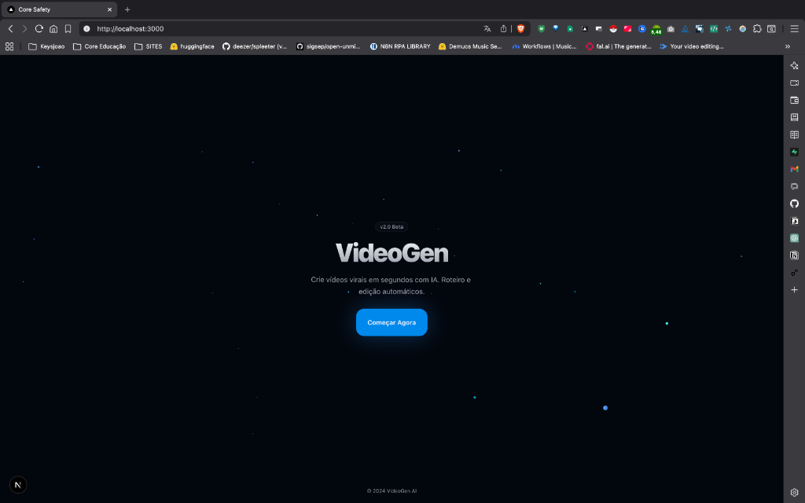
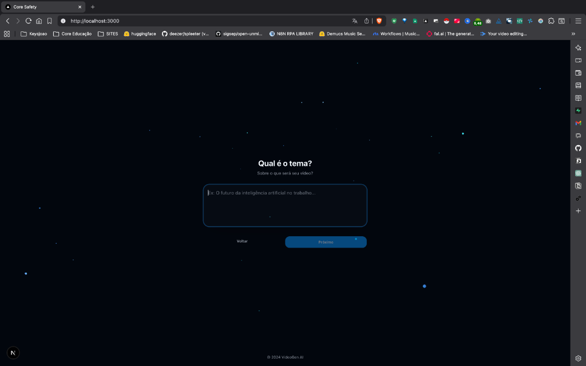
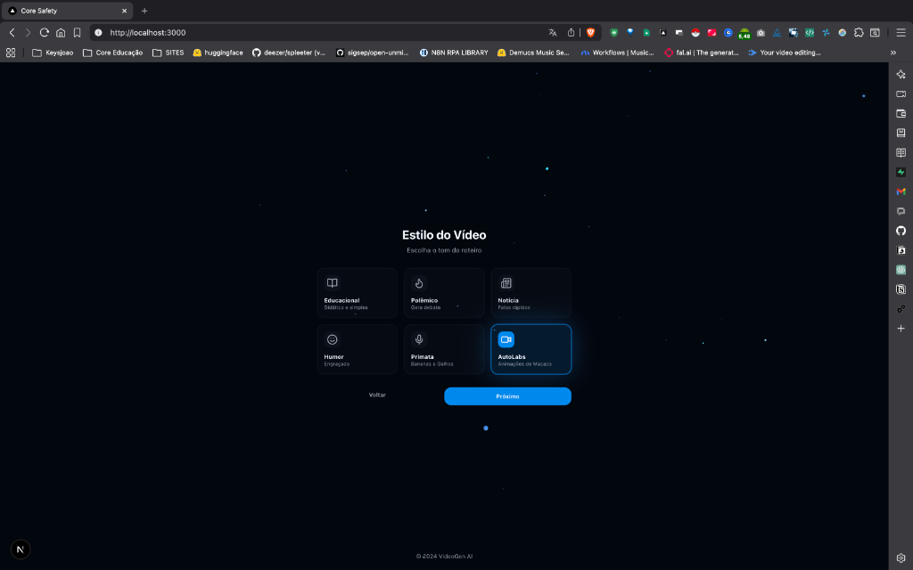
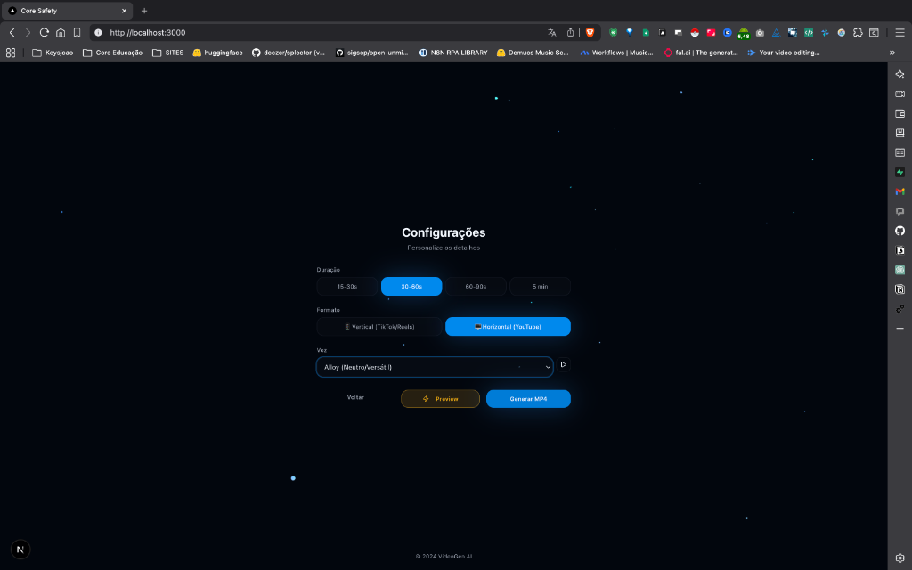

<p align="center">
  
</p>

<h1 align="center">🎬 VideoGen AI</h1>

<p align="center">
  <strong>Crie vídeos virais em segundos com IA</strong><br>
  Roteiro e edição automáticos • Múltiplos estilos • TTS integrado
</p>

<p align="center">
  
  
  
  
</p>

---

## ✨ Features

- 🤖 **Geração de Roteiros com IA** - Usando Google Gemini para criar roteiros engajantes
- 🎙️ **Text-to-Speech** - Integração com OpenAI TTS e ElevenLabs
- 🎨 **Múltiplos Estilos** - Educacional, Polêmico, Notícia, Humor, Primata, AutoLabs
- ⏱️ **Durações Flexíveis** - De 15 segundos a 5 minutos
- 📱 **Formatos** - Vertical (TikTok/Reels) e Horizontal (YouTube)
- 🎵 **Música de Fundo** - Trilhas automáticas para cada estilo
- 📝 **Legendas Automáticas** - Geradas via Whisper API

---

## 📸 Screenshots

<details>
<summary><strong>Ver todas as telas</strong></summary>

### 🏠 Tela Inicial


### 📝 Definir Tema


### 🎨 Escolher Estilo


### ⚙️ Configurações


</details>

---

## 🚀 Quick Start

### Pré-requisitos

- Python 3.10+
- Node.js 18+
- FFmpeg instalado no sistema

### 1. Clone o repositório

```bash
git clone https://github.com/keysjoao/MON-keysjoao.git
cd MON-keysjoao
```

### 2. Configure as variáveis de ambiente

```bash
cp .env.example .env
# Edite .env com suas API keys
```

Você vai precisar de:
- `OPENAI_API_KEY` - Para TTS e Whisper
- `ELEVENLABS_API_KEY` - (Opcional) Para vozes ElevenLabs
- `GOOGLE_API_KEY` - Para geração de roteiros com Gemini

### 3. Instale as dependências do Backend

```bash
cd videogen
pip install -r requirements.txt
```

### 4. Instale as dependências do Frontend

```bash
cd frontend
npm install
```

### 5. Execute o projeto

**Terminal 1 - Backend:**
```bash
cd videogen
uvicorn app.main:app --reload --port 8000
```

**Terminal 2 - Frontend:**
```bash
cd videogen/frontend
npm run dev
```

Acesse: http://localhost:3000

---

## 🏗️ Arquitetura

```
videogen/
├── app/                    # Backend FastAPI
│   ├── main.py            # Endpoints da API
│   ├── models/            # Schemas Pydantic
│   ├── services/          # Lógica de negócio
│   │   ├── audio_gen.py   # Geração de áudio (TTS)
│   │   ├── video_gen.py   # Renderização de vídeo (FFmpeg)
│   │   └── script_gen.py  # Geração de roteiros (Gemini AI)
│   └── utils/             # Utilitários
├── assets/                # Assets estáticos
│   ├── characters/        # Imagens de personagens
│   ├── music/             # Músicas de fundo
│   ├── tech_logos/        # Logos de tecnologias
│   └── voices/            # Previews de vozes
├── frontend/              # Frontend Next.js
│   └── src/
│       ├── app/           # Pages (App Router)
│       └── components/    # Componentes React
└── output/                # Vídeos gerados
```

---

## 🎨 Estilos Disponíveis

| Estilo | Descrição |
|--------|-----------|
| 📚 **Educacional** | Didático e simples |
| 🔥 **Polêmico** | Gera debate |
| 📰 **Notícia** | Fatos rápidos |
| 😂 **Humor** | Engraçado |
| 🐵 **Primata** | Bananas e Jeithos |
| 🤖 **AutoLabs** | Animações de Macaco |

---

## 🔧 API Endpoints

| Método | Endpoint | Descrição |
|--------|----------|-----------|
| `POST` | `/api/generate` | Gera um vídeo completo |
| `POST` | `/api/preview` | Gera preview rápido |
| `GET` | `/api/voices` | Lista vozes disponíveis |
| `GET` | `/api/styles` | Lista estilos disponíveis |

---

## 🤝 Contribuindo

Contribuições são bem-vindas! Sinta-se à vontade para abrir issues e pull requests.

---

## 📄 Licença

Este projeto está sob a licença MIT. Veja o arquivo [LICENSE](LICENSE) para mais detalhes.

---

<p align="center">
  Feito com ❤️ por <a href="https://github.com/keysjoao">@keysjoao</a>
</p>
